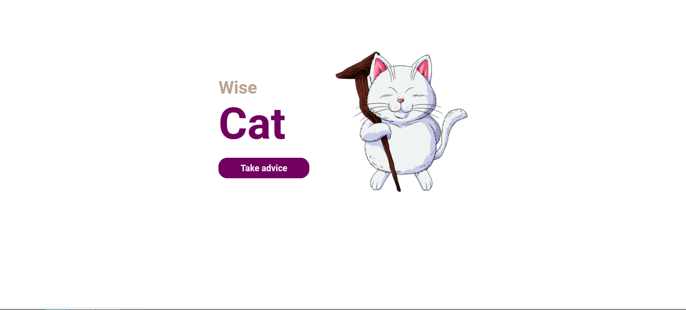
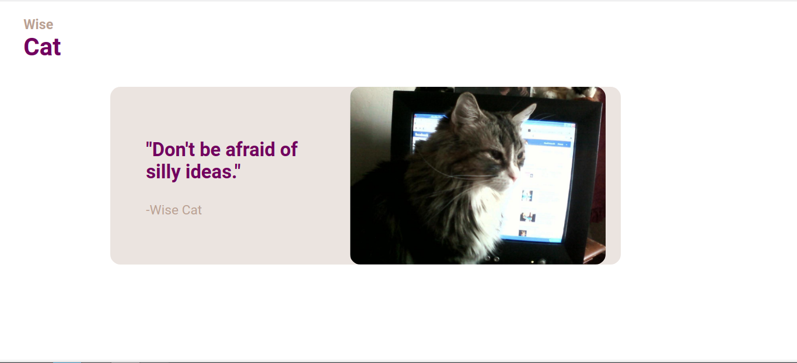

<h1 align="center">Wise Cat</h1>

<h4 align="center">Conselhos de um sábio gato</h4>
 

Esse projeto foi desenvolvido a partir de um desafio visto em: https://www.devchallenge.com.br/challenges/5f14f8d5130a5d78f89d9640/details. E durante a construção do desafio, umas das APIs fornecidas não estava mais disponível, então tive a ideia de fazer uma adaptação, transformando Wise Goat em Wise Cat.

Acesse: https://maarimukai.github.io/wisecat/

 

Um projeto simples, mas bem divertido!

